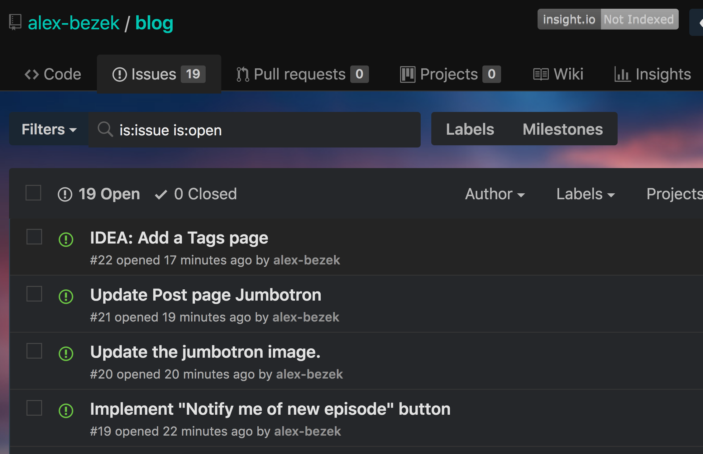

Everyone has their ways that they get things done. Most of us also have habits that we know impede our productivity. For me, one of those things is having a very open ended project, without a clear goal in sight. When this happens, I'll often find myself drifting towards answering emails, slack notifications, code reviews. Basically trying to do little distractions that are still productive.

So at work, how do I solve this? Well, I take the usual agile approach. Break the story into smaller pieces. For my team, or for myself, at work I will normally to try break down a story as small as possible. For certain projects, just breaking down into indivdual bullet points can do wonders. Usually I will end up breaking the main project into bullets, and then progressively break each bullet into smaller sub ideas until you have separate jiras or acceptance criteria.

So how can I apply this to personal projects I program in my free time? Well unfortunately those same distraction habbits I can have at work happen to follow me home. I got some mockups recently for this blog site I'm trying to construct, and I have been trying to find the time to iplement them. After experiencing it a few times, I think I have pinpointed the issue. In this specific project, there is no clear step by step process to end up at the achieved UI goals and I don't have a clear understanding in my head on how to complete each CSS visual I see.

To fix this issue in my personal project, I chose the same approach as work and agile. Break it down. Specifically into github issues

It might seem silly to break down a personal project into individual github issues. For me the plan though is to provide focuse to an single small task I feel could be completed in a single evening. In previous nights this week, I have booted up the app, compared it to the mockups, and started investigating how to solve some css issue. Its very easy to start looking into why the header doesn't align vertically properly in mobile, to then see if the header is aligned too, and end up troublshooint an issue in the header layout.

The goal is to make each issue as small as possible so I can try to complete 1 every couple evenings while focusing on it. Some are as small as to update the hover style for the nav items. Others involve more complex, stateful operations like updating the index page to show cards based off which category pill is clicked. My goal is that I can come home, pick a single task, and focus completely on that, trying to get it done that night. Basically, like an agile based jira, trying to prevent scope creep.

Ok, some of these aren't 1 night things right? I want to implement a comments section on a blog post, but I have never done this and I'm not familiar with the solutions to do this. So, I'll take another page from the agile book around SPIKES. I made a couple spike issues that allow me to just spend a couple nights to do some reading, or watch videos on the topic.

So, hopefully this helps me focus and complete some tasks on this project in the upcoming weeks. If you are really intuitive, you may point out that this post itself might have been a procrastination technique to actually completing a task, but I argue it will be better in the long run. Anyways, the issues are public, so you can keep me honest :D